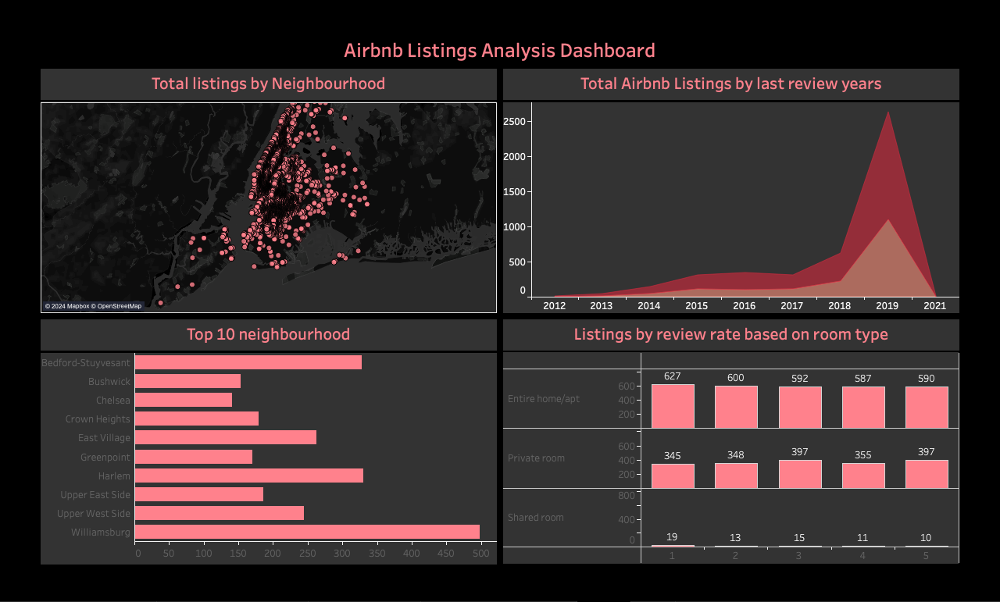

# Airbnb Dashboard in Tableau

## Overview

This project analyzes Airbnb data to gain insights into listings, pricing, availability, and reviews using an interactive **Tableau dashboard**. The dataset was sourced from **Kaggle** and provides detailed information about Airbnb properties, hosts, and guest reviews across different cities.

The Tableau dashboard provides a visual representation of the data, allowing users to explore various metrics such as pricing trends, host performance, property types, and geographical distribution.

## Dashboard Screenshot

Here’s a preview of the Excel VBA healthcare dashboard:



## Project Features

- **Interactive Visualizations**: Explore Airbnb data with a user-friendly Tableau dashboard that includes filters, tooltips, and customizable views.
- **Pricing Analysis**: Visualize average prices across different property types, neighborhoods, and dates.
- **Availability and Reviews**: Analyze the availability of properties over time, as well as the frequency and sentiment of guest reviews.
- **Geographical Distribution**: A map-based analysis to identify popular neighborhoods and property hotspots.

## Dataset

- **Source**: The dataset used in this project was collected from [Kaggle](https://www.kaggle.com/), which provides extensive data on Airbnb listings in various cities worldwide.
- **Dataset Description**: The dataset contains information such as:
  - **Listing ID**: Unique identifier for each Airbnb listing.
  - **Host Information**: Data about the host, such as host ID, name, and number of listings.
  - **Property Details**: Data about the property type, location, number of bedrooms, and maximum guest capacity.
  - **Pricing**: Data on listing prices, cleaning fees, and monthly and weekly rates.
  - **Availability**: Number of days the property is available for booking.
  - **Reviews**: Guest reviews including review date, ratings, and comments.

## Project Structure

```plaintext
Airbnb-Tableau-Dashboard/
│
├── data/                                 # Folder for dataset (not included due to size)
│   └── airbnb_data.csv                   # CSV file with Airbnb data from Kaggle
├── visualizations/                       # Folder for Tableau files and screenshots
│   ├── airbnb_dashboard.twbx             # Tableau dashboard file
│   ├── airbnb_dashboard_screenshot.png   # Screenshot of the Tableau dashboard
├── README.md                             # Project documentation (this file)
```
## Acknowledgements
- Kaggle: Special thanks to Kaggle for providing the dataset used in this project.
- Tableau: Thanks to Tableau for offering a powerful tool to visualize and explore the data.
